# CommitScope

CommitScope turns Git history into queryable code-health datasets and dashboards. It deploys an AWS pipeline with Terraform, runs analysis in ECS via Step Functions, stores raw and processed outputs in S3, catalogs them with Glue, queries them with Athena, and visualizes them in QuickSight.

## What Works

- GitHub Actions deploys the dev environment in AWS
- Step Functions runs the analysis pipeline end-to-end
- ECS Fargate executes the analysis container successfully
- outputs are written to S3 under `raw/`, `processed/`, and `curated/`
- Glue catalogs the generated datasets
- Athena queries the processed metrics
- QuickSight dashboards read the Athena-backed datasets directly
- each new cloud execution replaces the previous repo snapshot in the dashboard-backed data lake
- the automated local test suite currently passes with `45` tests

## Architecture

`GitHub Actions -> Terraform -> Step Functions -> Lambda -> ECS Fargate -> S3 -> Glue -> Athena -> QuickSight`

## Evidence

### Deployment

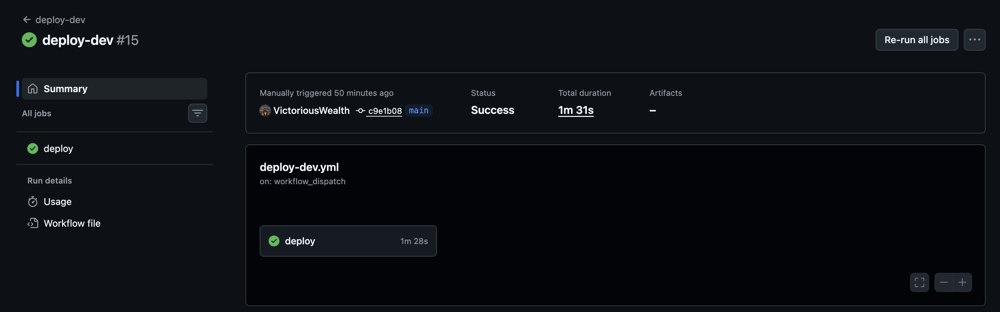
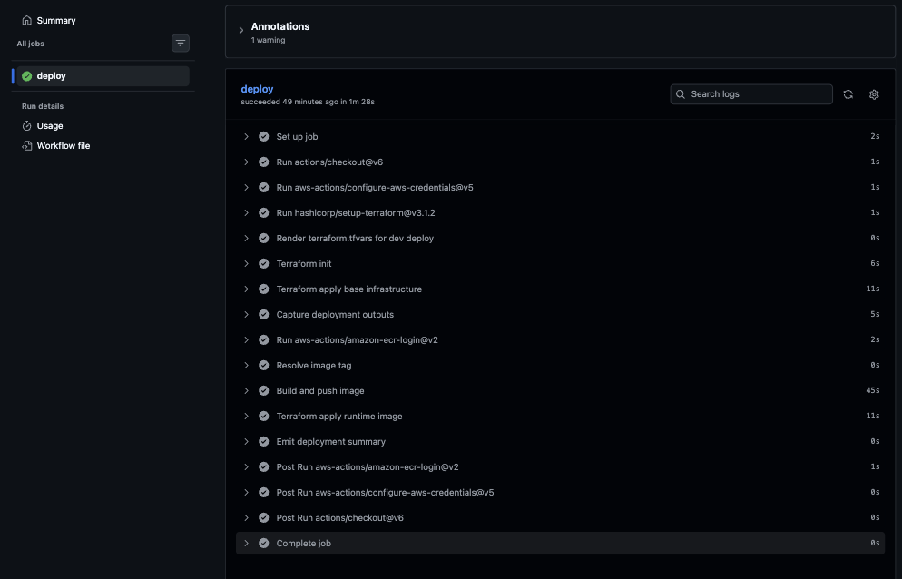

### Workflow Execution

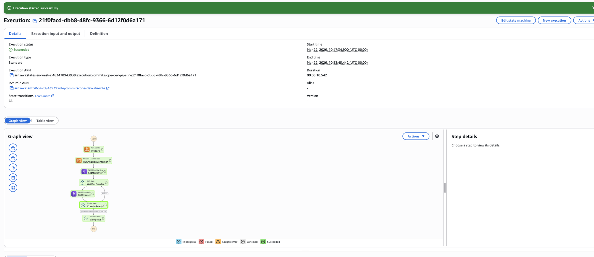
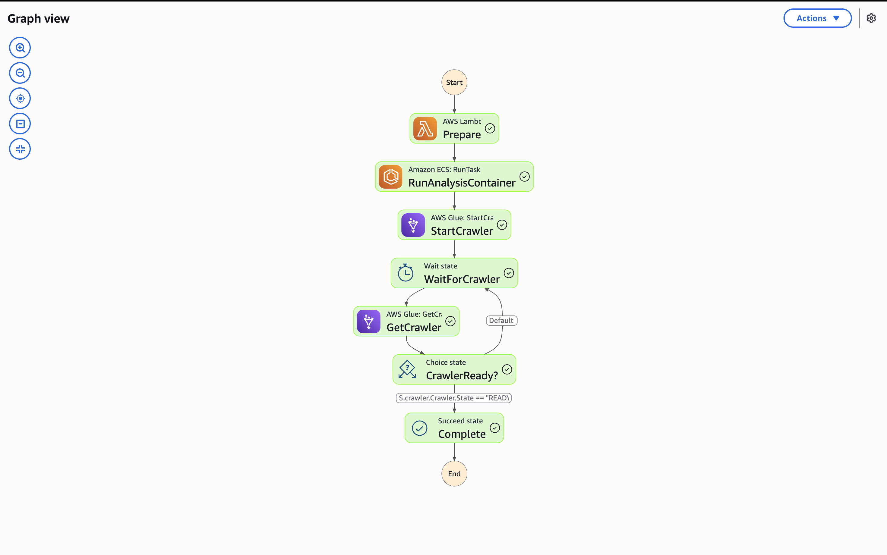
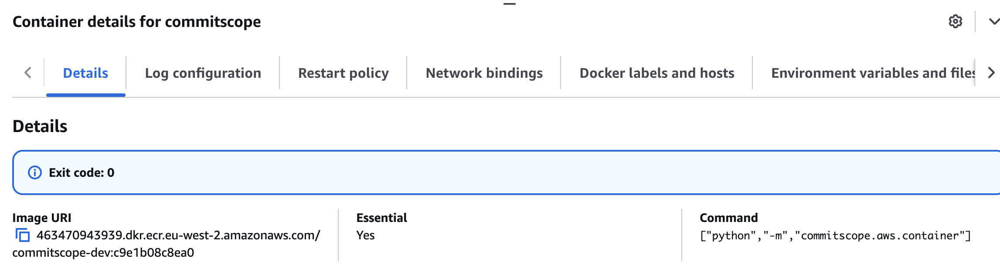

### Data Outputs

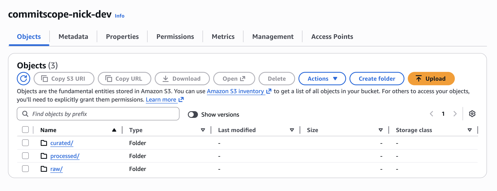
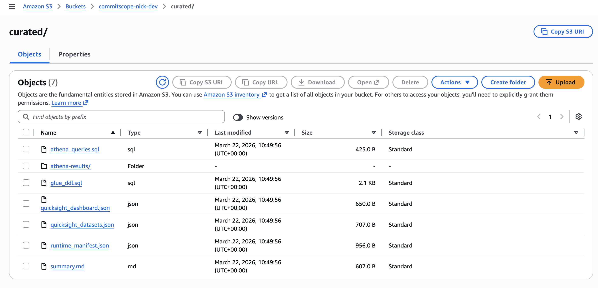
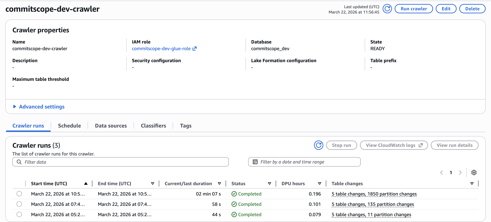
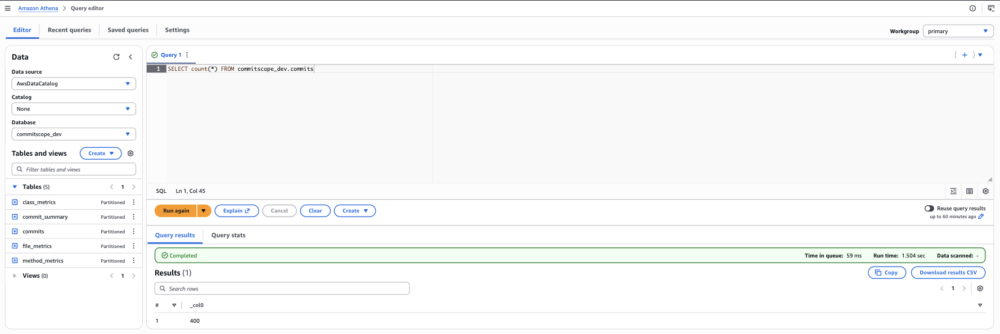

### Dashboards

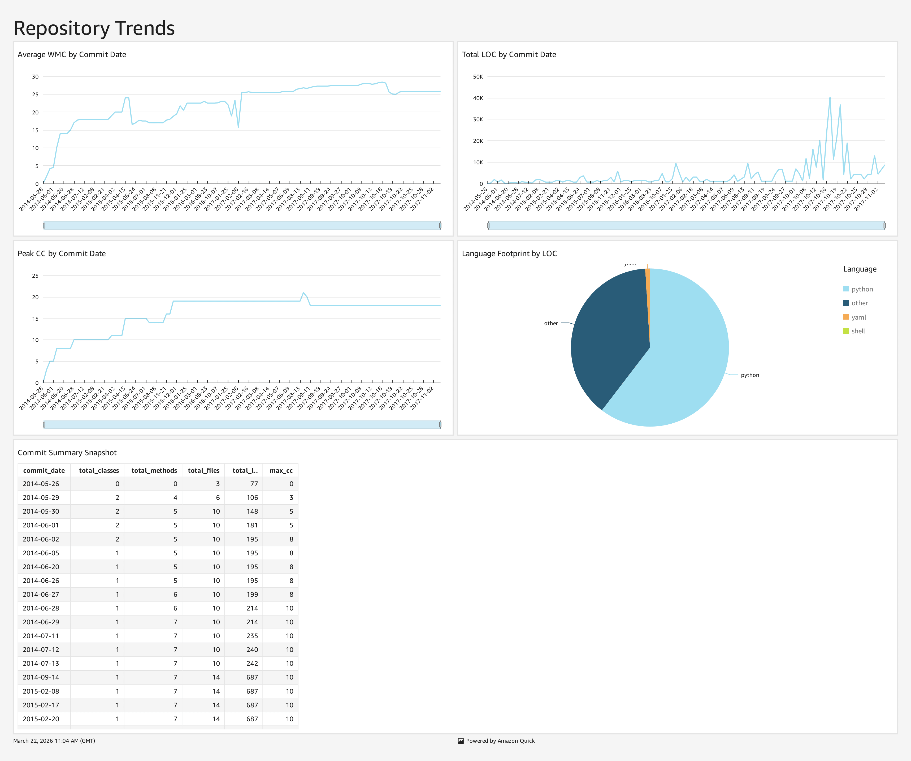
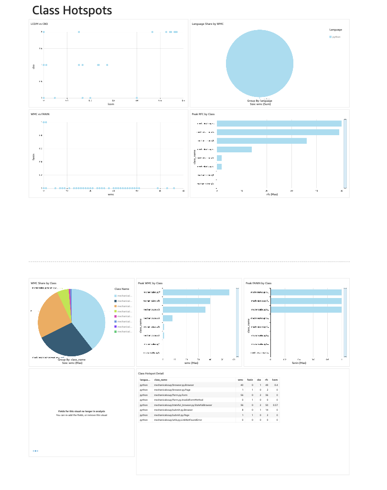
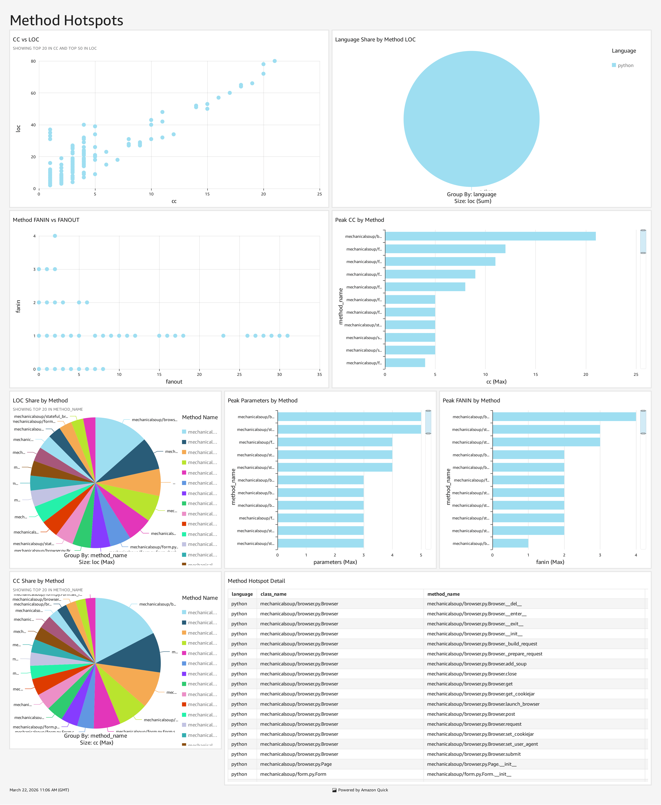

## Metrics

The pipeline computes and exposes:

- `WMC`
- `LCOM`
- `CC`
- `FANIN`
- `FANOUT`
- `CBO`
- `RFC`
- `LOC`
- `LLOC`
- commit-level repository summaries

Metric semantics and approximations are documented in [metric_contract.md](/Users/efeon/commitscope/docs/metric_contract.md).

## Language Support

- Python: AST-backed class and method analysis
- Java: AST-backed class and method analysis via `JavaParser`
- JavaScript: AST-backed class and method analysis via `@babel/parser`
- TypeScript: AST-backed class and method analysis via `ts-morph`
- other languages: file-level summaries where supported by the language mapper

## Testing

Run the full local suite with:

```bash
PYTHONPATH=src .venv/bin/python -m pytest -q
```

## Implementation Evidence

- Terraform orchestration: [main.tf](/Users/efeon/commitscope/infrastructure/terraform/envs/dev/main.tf)
- QuickSight provisioning automation: [provision_quicksight.py](/Users/efeon/commitscope/scripts/provision_quicksight.py)
- Manual operating procedure: [manual_execution.md](/Users/efeon/commitscope/docs/manual_execution.md)
- Container run notes: [container_run.md](/Users/efeon/commitscope/docs/container_run.md)

## Docs

- manual execution: [manual_execution.md](/Users/efeon/commitscope/docs/manual_execution.md)
- AWS deployment: [aws_deploy.md](/Users/efeon/commitscope/docs/aws_deploy.md)
- metric contract: [metric_contract.md](/Users/efeon/commitscope/docs/metric_contract.md)
- original project/product write-up: [PRD.md](/Users/efeon/commitscope/PRD.md)
